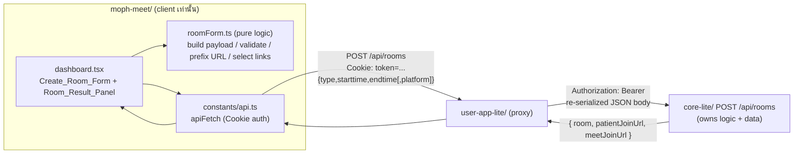

# Design Document

## Overview

ฟีเจอร์นี้ปรับ flow การสร้างห้อง (ห้องตรวจ / ห้องประชุม) ใน **Mobile_App**
(`moph-meet/`) ให้ parity กับ **Web_App** (`user-app-lite/`) ซึ่งเป็น source of
truth. ปัจจุบัน mobile กดปุ่มแล้วยิง `POST /api/rooms` ทันทีด้วย body `{ type }`
เท่านั้น ไม่มีฟอร์มนัดหมาย ไม่มีการแปลง/แสดงลิงก์ผลลัพธ์แบบคัดลอก/แชร์ได้ ผลคือ
ห้องที่สร้างจากมือถือไม่มี `starttime`/`endtime` ตามที่ผู้ใช้ตั้งใจ และ UX ต่างจากเว็บ

เป้าหมายของ design นี้:

1. เพิ่ม **Create_Room_Form** (วันที่ / เวลาเริ่ม / เวลาสิ้นสุด) ก่อนสร้างห้อง โดย
   ประกอบ **Start_Datetime** / **End_Datetime** เป็น string รูปแบบ
   `YYYY-MM-DDTHH:mm:00` (local, ไม่มี timezone suffix) ให้ **ตรงกับที่เว็บส่ง**.
2. ส่ง `POST /api/rooms` ด้วย body `{ type, starttime, endtime }` ผ่าน Proxy ด้วย
   **Cookie auth** เดิม (case-016 fix) โดยไม่ตั้ง `Authorization`.
3. แสดง **Room_Result_Panel** พร้อมชื่อห้อง (`room.name`) และลิงก์ที่เกี่ยวข้อง
   (Patient_Join_Link สำหรับ exam / Meet_Join_Link สำหรับ meet) ที่แปลงเป็น URL
   เต็มด้วย `API_BASE` และ **คัดลอก/แชร์** ได้.
4. คงขอบเขต **lite-only**: ไม่ย้าย business logic เข้าแอป, ใช้ endpoint `/api/*`
   ที่มีอยู่, ใช้ `room.name` ที่ Core_API สร้างให้.
5. (Optional dependency) ส่งค่าบ่งชี้ platform = "mobile" เพื่อให้ Core_API log
   `room_created` ด้วย `platform = "mobile"` — งานฝั่ง server อยู่ที่ `core-lite/`.

### สิ่งที่ได้ยืนยันจาก source ที่มีอยู่ (research)

- **Backend รองรับ `starttime`/`endtime` แบบ optional อยู่แล้ว.**
  `core-lite/src/index.js` route `POST /api/rooms` อ่าน `{ type, starttime, endtime }`
  และ fallback เป็น `now` / `now+1h` เมื่อไม่ส่ง — parity หลักทำได้โดยไม่ต้องแก้ backend.
- **รูปแบบ payload ของเว็บ** (`user-app-lite/views/dashboard.ejs`,
  `public/index.html`): `starttime = date + 'T' + time + ':00'`,
  `endtime = date + 'T' + time + ':00'` — ยืนยันรูปแบบ `YYYY-MM-DDTHH:mm:00`.
- **การตีความผลลัพธ์ของเว็บ:** ใช้ `data.room.name`, `origin + data.meetJoinUrl`
  (meet), `origin + data.patientJoinUrl` + ปุ่ม `เข้าห้องตรวจ` → `/exam/{id}` (exam).
  บนมือถือ prefix จะเป็น `API_BASE` แทน `location.origin` และปุ่มหมอไปที่
  `/doctor/{roomId}` (หน้าควบคุมหมอของแอป).
- **Proxy behavior สำคัญ:** `user-app-lite/server.js` (`app.use('/api', ...)`)
  แปลง cookie token → `Authorization: Bearer` ตอน forward ไป core-lite และ
  **re-serialize `req.body` เป็น JSON** แต่ **ส่งต่อเฉพาะ header `Content-Type`**
  (ไม่ forward custom header อื่น). ผลเชิงออกแบบ: **platform hint ต้องเป็น body
  field** (`platform: 'mobile'`) จึงจะรอดผ่าน proxy ไปถึง core-lite — custom
  header จะถูกทิ้ง. (Requirement 9)
- **Cookie auth helper มีอยู่แล้ว** ใน `constants/api.ts` (`buildApiRequestInit`,
  `apiFetch`) ส่ง `Cookie: token=...` + `credentials: 'include'` และไม่ตั้ง
  `Authorization` — จะ reuse ตามเดิม ห้าม regress.
- **ยังไม่มี clipboard lib** ใน `moph-meet/package.json` → design เลือกใช้
  `expo-clipboard` (สอดคล้อง Expo SDK 53) สำหรับคัดลอก และใช้ React Native
  `Share` API (built-in) สำหรับแชร์.

## Architecture

ขอบเขตยังคงเป็น client-only ใน `moph-meet/` ตาม `mobile-app.md` และ `lite-only.md`:



การเปลี่ยนแปลงหลักอยู่ที่ 2 ระดับ:

1. **Presentation (dashboard.tsx):** แทนที่ `createRoom(type)` ที่ยิงทันที ด้วย
   flow แบบ 2 สเต็ป — เปิดฟอร์ม (modal) → ยืนยัน → แสดง result panel. ปุ่ม
   "สร้างห้องตรวจ" / "สร้างห้องประชุม" เปลี่ยนเป็น "เปิดฟอร์ม" แทน "สร้างทันที".
2. **Pure logic (constants/roomForm.ts ใหม่):** แยก logic ที่ทดสอบได้ออกจาก UI —
   ประกอบ datetime, validate, prefix URL, และเลือกลิงก์ที่จะแสดงตามชนิดห้อง.
   ไม่ถือเป็น "business logic ของการสร้างห้อง" (นั่นอยู่ที่ core-lite) แต่เป็น
   input-shaping/response-interpretation ฝั่ง client เพื่อให้ payload/ผลลัพธ์
   parity กับเว็บ.

**Server dependency (Requirement 9, optional):** เพื่อ log platform = "mobile"
ต้องแก้ `core-lite/src/index.js` ให้รับ `platform` hint จาก body (ค่า allow-list
`'mobile'` | `'web'`, default `'web'`). งานนี้อยู่นอก `moph-meet/` ตาม lite-only
และควรยืนยันกับเจ้าของ spec ก่อนทำ — แยกเป็น task ที่ทำเครื่องหมาย dependency.

## Components and Interfaces

### 1. `constants/roomForm.ts` (ใหม่ — pure, ทดสอบได้)

โมดูลฟังก์ชันบริสุทธิ์ ไม่มี side-effect ไม่แตะ network/UI. เป็นหัวใจของ parity
contract และเป็นเป้าหมายหลักของ property-based tests.

```typescript
export type RoomType = 'exam' | 'meet';

export type CreateRoomInput = {
  type: RoomType;
  date: string;        // 'YYYY-MM-DD'
  startTime: string;   // 'HH:mm'
  endTime: string;     // 'HH:mm'
};

export type CreateRoomBody = {
  type: RoomType;
  starttime: string;   // 'YYYY-MM-DDTHH:mm:00'
  endtime: string;     // 'YYYY-MM-DDTHH:mm:00'
  platform?: 'mobile'; // Requirement 9 (optional platform hint)
};

export type ValidationResult =
  | { ok: true }
  | { ok: false; message: string };

export type CreateRoomResponse = {
  room?: { id?: string; name?: string } | null;
  patientJoinUrl?: string | null;
  meetJoinUrl?: string | null;
};

// ประเภทของลิงก์ที่ result panel จะแสดง (เลือกตามชนิดห้อง)
export type ResultLinks = {
  roomName: string;              // '' ถ้าไม่มี
  roomId: string | null;
  patientLink: string | null;    // full URL (exam เท่านั้น)
  meetLink: string | null;       // full URL (meet เท่านั้น)
  doctorRoute: string | null;    // '/doctor/{id}' (exam เท่านั้น)
  meetRoute: string | null;      // '/meet/{id}'   (meet เท่านั้น)
};

/** ประกอบ 'YYYY-MM-DDTHH:mm:00' จาก date + time (ตรงกับเว็บ). */
export function toDatetimeString(date: string, time: string): string;

/** สร้าง body ของ POST /api/rooms ให้ parity กับเว็บ (+ platform hint optional). */
export function buildCreateRoomBody(
  input: CreateRoomInput,
  opts?: { platform?: 'mobile' },
): CreateRoomBody;

/** ตรวจสอบฟอร์มก่อนส่ง: ห้ามมีช่องว่าง และ end ต้องไม่อยู่ก่อน start. */
export function validateCreateRoomInput(input: CreateRoomInput): ValidationResult;

/** แปลง relative path เป็น URL เต็มด้วย API_BASE (absolute ผ่านตรง ๆ). */
export function toFullUrl(pathOrUrl: string | null | undefined, apiBase: string): string | null;

/** เลือก/แปลงลิงก์ที่จะแสดงใน Room_Result_Panel ตามชนิดห้อง. */
export function selectResultLinks(
  type: RoomType,
  resp: CreateRoomResponse,
  apiBase: string,
): ResultLinks;

/** ค่าวันที่ปัจจุบันในรูปแบบ 'YYYY-MM-DD' (ค่า default ของช่องวันที่). */
export function todayDateString(now?: Date): string;
```

พฤติกรรมสำคัญ:

- `toDatetimeString('2025-02-01', '09:30') === '2025-02-01T09:30:00'` (ตรง
  `fd.get('date') + 'T' + fd.get('starttime') + ':00'` ของเว็บ).
- `buildCreateRoomBody` ต้องสร้าง field ชุดเดียวกับเว็บ (`type`, `starttime`,
  `endtime`) สำหรับ input เดียวกัน; `platform` เพิ่มเฉพาะเมื่อร้องขอ.
- `validateCreateRoomInput`: ถ้า date/startTime/endTime ช่องใดว่าง (หลัง trim) →
  `{ ok:false }`; ถ้า `endtime <= starttime` (เทียบ datetime ที่ประกอบแล้ว) →
  `{ ok:false }`; อื่น ๆ → `{ ok:true }`.
- `toFullUrl`: `null/undefined/''` → `null`; ขึ้นต้น `http` → คืนค่าเดิม; อื่น ๆ →
  `apiBase + path`.
- `selectResultLinks`: exam → เซ็ตเฉพาะ `patientLink` + `doctorRoute`; meet →
  เซ็ตเฉพาะ `meetLink` + `meetRoute`; field ที่ไม่เกี่ยวกับชนิดห้อง = `null`
  (Requirement 8.3 — ไม่แสดง field ที่ไม่เกี่ยวข้อง).

### 2. `app/dashboard.tsx` (แก้ไข)

- **State ใหม่:** `formVisible: boolean`, `formType: RoomType`,
  `formInput: CreateRoomInput`, `formError: string | null`, `submitting: boolean`,
  `result: ResultLinks | null`.
- **ปุ่มสร้างห้อง:** `onPress={() => openForm('exam')}` /
  `openForm('meet')` — เปิด Create_Room_Form พร้อม default วันที่ = วันนี้
  (`todayDateString()`) เมื่อช่องวันที่ยังว่าง; ไม่ยิง API ทันที.
- **Create_Room_Form (Modal):** ช่อง วันที่ / เวลาเริ่ม / เวลาสิ้นสุด + ข้อความ
  กำกับตามชนิดห้อง (exam: "ชื่อห้องสร้างอัตโนมัติ ระบบจะบันทึกวิดีโออัตโนมัติ";
  meet: "ชื่อห้องสร้างอัตโนมัติ ผู้เข้าร่วมต้องล็อกอินด้วย Provider ID") + ปุ่ม
  ยกเลิก/ยืนยัน. ช่องทำเครื่องหมาย required (คำแนะนำเชิงภาพ) แต่การบล็อกจริงมาจาก
  `validateCreateRoomInput` (Requirement 3.3).
- **submitCreateRoom():** เรียก `validateCreateRoomInput`; ถ้าไม่ผ่าน → เซ็ต
  `formError` และ **ไม่** เรียก API. ถ้าผ่าน → `submitting = true` (ปิดปุ่มยืนยัน),
  `buildCreateRoomBody(input, { platform: 'mobile' })`, `apiFetch('/api/rooms', token,
  { method:'POST', body })`. จัดการผลตาม Error Handling ด้านล่าง แล้วเซ็ต
  `result = selectResultLinks(type, data, API_BASE)` เพื่อสลับไป Room_Result_Panel.
- **Room_Result_Panel:** แสดง `result.roomName`, ลิงก์ที่ไม่ null พร้อมปุ่ม
  **คัดลอก** (expo-clipboard) และ **แชร์** (Share API), ปุ่มนำทาง:
  - exam → ปุ่ม "เข้าห้องตรวจ" → `router.push(result.doctorRoute)`; ซ่อนตัวเลือก
    เข้าห้องประชุม.
  - meet → ปุ่ม "เข้าห้องประชุม" → `router.push(result.meetRoute)`.

### 3. `constants/api.ts` (คงเดิม / reuse)

ใช้ `apiFetch` + `buildApiRequestInit` เดิม (Cookie auth, ไม่ตั้ง `Authorization`).
Export `API_BASE` ให้ dashboard ใช้ prefix ลิงก์. ไม่แก้พฤติกรรม auth.

### 4. Clipboard / Share

- `expo-clipboard` → `Clipboard.setStringAsync(fullUrl)` สำหรับคัดลอก.
- React Native `Share.share({ message: fullUrl })` สำหรับแชร์.
- ทั้งสองรับ **full URL** จาก `ResultLinks` (ผ่าน `toFullUrl` แล้ว).

### 5. `core-lite/src/index.js` (Requirement 9 เท่านั้น — server dependency, optional)

รับ `platform` จาก `req.body` (allow-list `['web','mobile']`, default `'web'`) และ
ใช้แทน `platform: 'web'` ที่ hardcode อยู่ใน log `room_created`. ไม่กระทบพฤติกรรม
สร้างห้องอื่น และคง default `'web'` เมื่อไม่มี hint (backward compatible).

## Data Models

### CreateRoomInput (client form state)

| Field | Type | หมายเหตุ |
|---|---|---|
| `type` | `'exam' \| 'meet'` | ชนิดห้อง |
| `date` | `string` | `YYYY-MM-DD`, default = วันนี้ |
| `startTime` | `string` | `HH:mm` |
| `endTime` | `string` | `HH:mm` |

### CreateRoomBody (payload → POST /api/rooms) — parity contract

| Field | Type | ที่มา / เทียบเว็บ |
|---|---|---|
| `type` | `'exam' \| 'meet'` | เท่ากับเว็บ |
| `starttime` | `string` | `date + 'T' + startTime + ':00'` (เท่ากับเว็บ) |
| `endtime` | `string` | `date + 'T' + endTime + ':00'` (เท่ากับเว็บ) |
| `platform` | `'mobile'?` | เพิ่มเฉพาะ mobile (Requirement 9); เว็บไม่ส่ง |

### CreateRoomResponse (จาก Core_API)

| Field | Type | ความหมาย (เท่ากับเว็บ) |
|---|---|---|
| `room` | `{ id, name, ... }` | ห้องที่สร้าง; `room.name` = ชื่อ auto จาก core |
| `patientJoinUrl` | `string \| null` | exam เท่านั้น; อาจเป็น relative path |
| `meetJoinUrl` | `string \| null` | meet เท่านั้น; อาจเป็น relative path |

### ResultLinks (view model ของ Room_Result_Panel)

| Field | Type | หมายเหตุ |
|---|---|---|
| `roomName` | `string` | จาก `room.name` (`''` ถ้าไม่มี) |
| `roomId` | `string \| null` | จาก `room.id` |
| `patientLink` | `string \| null` | full URL, exam เท่านั้น |
| `meetLink` | `string \| null` | full URL, meet เท่านั้น |
| `doctorRoute` | `string \| null` | `/doctor/{id}`, exam เท่านั้น |
| `meetRoute` | `string \| null` | `/meet/{id}`, meet เท่านั้น |

## Correctness Properties

*A property is a characteristic or behavior that should hold true across all
valid executions of a system — essentially, a formal statement about what the
system should do. Properties serve as the bridge between human-readable
specifications and machine-verifiable correctness guarantees.*

คุณสมบัติเหล่านี้กำหนดบนฟังก์ชันบริสุทธิ์ใน `constants/roomForm.ts` และ
`constants/api.ts` ซึ่งเป็นชั้น logic ที่ทดสอบได้ (ส่วน UI/navigation/clipboard
ทดสอบด้วย example/interaction ตาม Testing Strategy).

### Property 1: Datetime composition ตรงรูปแบบเว็บ

*For any* วันที่ `date` รูปแบบ `YYYY-MM-DD` และเวลา `time` รูปแบบ `HH:mm`,
`toDatetimeString(date, time)` ต้องเท่ากับ `` `${date}T${time}:00` `` และตรง pattern
`^\d{4}-\d{2}-\d{2}T\d{2}:\d{2}:00$` (ตรงกับสูตร `fd.get('date') + 'T' + fd.get(time) + ':00'` ของ Web_App).

**Validates: Requirements 1.4**

### Property 2: Payload parity กับเว็บ (type + datetime)

*For any* `CreateRoomInput` ที่ครบถ้วน, `buildCreateRoomBody(input)` (โดยไม่รวม
`platform`) ต้องได้ `{ type, starttime, endtime }` ที่ `type` เท่ากับ `input.type`,
`starttime = toDatetimeString(date, startTime)`, `endtime = toDatetimeString(date, endTime)`
— ตรงกับ body ที่ Web_App สร้างจาก input เดียวกันทุก field.

**Validates: Requirements 1.3, 2.2, 8.1**

### Property 3: Validation ระงับเมื่อมีช่องว่าง

*For any* `CreateRoomInput` ที่มี `date` หรือ `startTime` หรือ `endTime`
อย่างน้อยหนึ่งช่องเป็นค่าว่างหรือ whitespace ล้วน, `validateCreateRoomInput(input)`
ต้องคืน `{ ok: false }` (จึงระงับการส่ง `POST /api/rooms`).

**Validates: Requirements 4.1**

### Property 4: Validation ระงับเมื่อ End ไม่หลัง Start

*For any* `CreateRoomInput` ที่ครบทุกช่อง, `validateCreateRoomInput` ต้องคืน
`{ ok: false }` เมื่อ End_Datetime ที่ประกอบแล้ว `<=` Start_Datetime และคืน
`{ ok: true }` เมื่อ End_Datetime `>` Start_Datetime.

**Validates: Requirements 4.2**

### Property 5: URL prefixing (relative → เต็มด้วย API_BASE)

*For any* string `p` และ `apiBase`:
- ถ้า `p` เป็น `null`/`undefined`/`''` → `toFullUrl(p, apiBase)` คืน `null`.
- ถ้า `p` ขึ้นต้นด้วย `http` → คืนค่า `p` เดิมไม่เปลี่ยนแปลง.
- อื่น ๆ (relative path) → คืน `apiBase + p` (ขึ้นต้นด้วย `apiBase` และลงท้ายด้วย `p`).

**Validates: Requirements 1.6, 2.4**

### Property 6: Result link selection ตามชนิดห้อง (mutual exclusivity + ไม่ข้ามชนิด + ไม่ throw)

*For any* `CreateRoomResponse` `resp` (รวมกรณี field ขาด/แนบ field ตรงข้ามมาด้วย)
และ `apiBase`, `selectResultLinks(type, resp, apiBase)`:
- ต้องไม่ throw และคืน `roomName` เป็น string เสมอ (`''` เมื่อไม่มี `room.name`).
- เมื่อ `type === 'exam'`: `meetLink === null` และ `meetRoute === null`; `patientLink`
  เป็น full URL ของ `patientJoinUrl` เมื่อมีค่า และ `doctorRoute === '/doctor/' + room.id`
  เมื่อมี `room.id` (ไม่งั้น `null`).
- เมื่อ `type === 'meet'`: `patientLink === null` และ `doctorRoute === null`; `meetLink`
  เป็น full URL ของ `meetJoinUrl` เมื่อมีค่า และ `meetRoute === '/meet/' + room.id`
  เมื่อมี `room.id`.

ครอบคลุมการตีความ field ให้ความหมายเดียวกับเว็บ (exam↔patient, meet↔meet), การไม่
แสดง field ที่ไม่เกี่ยวกับชนิดห้อง, การนำทางแบบ mutually exclusive, และการแสดง
empty result panel โดยไม่เข้าสถานะ error เมื่อ field ขาด.

**Validates: Requirements 1.5, 2.3, 5.3, 5.4, 8.2, 8.3**

### Property 7: Platform hint

*For any* `CreateRoomInput` ที่ครบถ้วน: `buildCreateRoomBody(input, { platform: 'mobile' }).platform === 'mobile'`;
และ `buildCreateRoomBody(input)` (ไม่มี opts) ต้อง **ไม่มี** field `platform`
(เพื่อคง parity กับเว็บและ backward-compat default `'web'` ฝั่ง core).

**Validates: Requirements 9.1**

### Property 8: Cookie auth request init (ไม่ Bearer)

*For any* `(path, token)`, `buildApiRequestInit(token, opts)` ต้องคืน options ที่มี
header `Cookie: token=<token>`, `credentials: 'include'`, และ **ไม่มี** header
`Authorization`. (property เดิมใน `constants/api.ts` — คงไว้ ห้าม regress case-016)

**Validates: Requirements 6.1**

## Error Handling

จัดการผลลัพธ์ของ `POST /api/rooms` ใน `submitCreateRoom()` ตามลำดับ:

| กรณี | เงื่อนไข | การจัดการ |
|---|---|---|
| Validation ไม่ผ่าน | `validateCreateRoomInput` คืน `ok:false` | แสดง `formError`, **ไม่**เรียก API (Req 4.1, 4.2) |
| 401 Unauthorized | `res.status === 401` | `clearAuth()` + `router.replace('/')` (Req 6.2) |
| Non-2xx อื่น | `!res.ok && status !== 401` | Alert "สร้างห้องไม่สำเร็จ" (พร้อมรหัสสถานะ) (Req 6.3) |
| สำเร็จแต่ไม่มี `room.id` | `res.ok` แต่ `!data.room?.id` | Alert "ไม่ได้รับรหัสห้อง" (Req 6.4) |
| Network error | `fetch` throw | Alert ข้อผิดพลาดเครือข่าย |
| สำเร็จ (มี `room.id`) | ปกติ | `selectResultLinks` → แสดง Room_Result_Panel; ถ้า link/name ขาดก็แสดง empty panel ไม่เข้า error (Req 2.3) |

- ระหว่าง request ตั้ง `submitting = true` เพื่อ **ปิดปุ่มยืนยัน** กันส่งซ้ำ และรีเซ็ต
  ใน `finally` (Req 4.3).
- คงการส่ง token ผ่าน **Cookie** เท่านั้น ไม่ตั้ง `Authorization` (Req 6.1).
- Clipboard/Share ล้มเหลว: จับ error เงียบ ๆ ไม่ให้กระทบสถานะ result panel.

## Testing Strategy

### แนวทางแบบคู่ (dual approach)

- **Property tests** (fast-check — มีอยู่ใน devDependencies แล้ว): ตรวจ property
  สากลของ pure logic ใน `constants/roomForm.ts` และ `constants/api.ts`.
- **Unit / interaction tests** (jest + jest-expo, react-test-renderer): ตรวจ
  example, UI presence, interaction, edge case, และ error path.
- **Integration tests** (Requirement 9): ทดสอบ platform hint ที่ฝั่ง `core-lite`
  ใน `tests/core-lite/` — ไม่ใช่ property (พฤติกรรม deterministic ตาม hint).

### Property-based testing

- ใช้ **fast-check** ไม่เขียน PBT เอง.
- แต่ละ property รัน **อย่างน้อย 100 iterations** (`{ numRuns: 100 }` ขึ้นไป).
- ครอบ edge case ผ่าน generator: whitespace-only strings (Req 4.1), non-ASCII/
  special characters ในชื่อห้อง/path, response ที่ field ขาด/`null`/แนบ field
  ตรงข้าม (Req 2.3, 6.4, 8.3), และ relative vs absolute URL (Req 1.6/2.4).
- แต่ละ property test ติด tag อ้างอิง design property:
  - รูปแบบ: `Feature: mobile-room-creation-parity, Property {number}: {property_text}`

Mapping property → test:

| Property | ฟังก์ชันที่ทดสอบ |
|---|---|
| 1 Datetime composition | `toDatetimeString` |
| 2 Payload parity | `buildCreateRoomBody` |
| 3 Validation empty | `validateCreateRoomInput` |
| 4 Validation order | `validateCreateRoomInput` |
| 5 URL prefixing | `toFullUrl` |
| 6 Result link selection | `selectResultLinks` |
| 7 Platform hint | `buildCreateRoomBody` |
| 8 Cookie auth init | `buildApiRequestInit` |

### Unit / interaction tests (example, edge, error)

- ฟอร์มแสดงก่อนยิง API สำหรับ exam/meet และยังไม่เรียก fetch (Req 1.1, 2.1).
- ข้อความกำกับ exam (บันทึกวิดีโออัตโนมัติ) / meet (ต้องล็อกอิน Provider ID),
  รวมข้อความ Provider ID ที่แสดงถาวรได้ (Req 2.5, 3.1, 3.2).
- required เป็น visual hint; submit อาศัย `validateCreateRoomInput` ไม่ใช่ native
  required (Req 3.3).
- ยกเลิกฟอร์ม → ปิดโดยไม่ยิง API (Req 3.4).
- ปุ่มยืนยัน disabled ระหว่าง submitting (mock fetch ช้า) (Req 4.3).
- result panel ที่มีลิงก์ → มีปุ่มคัดลอก/แชร์ (Req 5.1); กดคัดลอก → `Clipboard.setStringAsync`
  ถูกเรียกด้วย **full URL** (mock expo-clipboard) (Req 5.2).
- error paths: 401 → `clearAuth` + กลับ login (Req 6.2); 500 → Alert ล้มเหลว
  (Req 6.3); 200 ไม่มี `room.id` → Alert ไม่ได้รับรหัสห้อง (Req 6.4).
- ข้อจำกัดเครื่อง (mobile-app.md): ถ้ารัน jest ผ่าน UNC/`npx` ไม่ได้ ให้พึ่ง
  language-server diagnostics + reasoning แล้วยืนยันจริงตอน build.

### Smoke / architecture checks (lite-only boundary)

- ยืนยันว่าแอปเรียกเฉพาะ `/api/rooms` ที่มีอยู่ ผ่าน proxy, ไม่มีการสร้างชื่อห้อง/
  business logic ในแอป และใช้ `room.name` จาก response เท่านั้น (Req 7.1, 7.2).
- การเปลี่ยนแปลง server-side (Req 9) อยู่ใน `core-lite/` ไม่ใช่ `moph-meet/` (Req 7.3).

### Integration tests — core-lite platform hint (Requirement 9, optional)

- ใน `tests/core-lite/`: `POST /api/rooms` พร้อม `platform: 'mobile'` → log
  `room_created` มี `platform = 'mobile'` (Req 9.2); ไม่มี hint → `platform = 'web'`
  (Req 9.3, backward compatible).

### หมายเหตุ dependency

- ต้องเพิ่ม dependency `expo-clipboard` ใน `moph-meet/package.json`.
- Requirement 9 ต้องแก้ `core-lite/src/index.js` ซึ่งอยู่นอก `moph-meet/` ตาม
  `lite-only.md` — เป็น optional ต่อ parity หลัก (Req 1–8) และควรยืนยันกับเจ้าของ
  spec ก่อนทำ.
