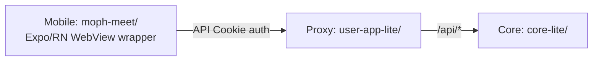
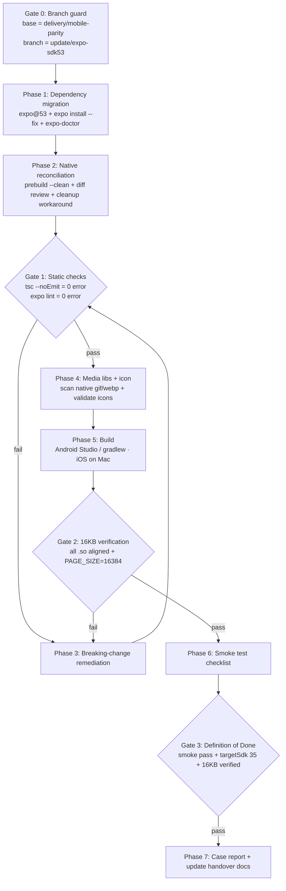

# Design Document

## Overview

เอกสารนี้อธิบายการออกแบบสำหรับงานอัปเกรด **MOPH Meet** (`moph-meet/`) จาก Expo SDK 52 → SDK 53 แบบ manual โดยมีเป้าหมายหลักคือทำให้ไลบรารี native (`.so`) ทุกตัวใน APK/AAB align ที่ **16KB page size** ตามที่ Google Play บังคับ (อ้างอิง `docs/mobile-sdk53-upgrade-plan.md` และ steering `mobile-app.md`)

งานนี้ไม่ใช่การเขียน feature ใหม่ในความหมายทั่วไป แต่เป็น **migration + build/verification workflow** ที่มีการเปลี่ยนแปลง 4 ด้านหลัก:

1. **Dependency migration** — ยก `expo` → `~53.0.x`, `react`/`react-dom` → `19.0.0`, `react-native` → `0.79.x`, และ dependency อื่นให้ตรง SDK 53 (Requirement 1, 2)
2. **Breaking-change remediation** — แก้โค้ดที่กระทบจาก React 19, reanimated 3.17, expo-router 5, react-native-webview บน RN 0.79 พร้อมทำให้ `tsc`/`lint` ผ่าน (Requirement 2, 3)
3. **Native config reconciliation** — regen `android/` ด้วย `prebuild --clean` แล้วรักษา custom config (permissions, package name, ndkVersion) ไม่ให้หาย, ลบ config plugin `withFmtFix.js` ที่ไม่จำเป็นออก (ไม่คงไว้), + ลบ workaround 16KB เดิม (Requirement 3, 4)
4. **Build + 16KB verification** — build Android (Android Studio) / iOS (Mac), ตรวจ ELF alignment ของ `.so` ทุกตัว, ยืนยันบน 16KB emulator, smoke test, ปิดงานด้วย case report (Requirement 5–9)

โดยมี **scope guard** คุมให้แก้เฉพาะภายใน `moph-meet/` (ยกเว้นเอกสาร report/handover) ไม่แตะ `core/`, `user-app/` และไม่ย้าย business logic เข้าแอป (Requirement 10)

### สถานะปัจจุบันที่ยืนยันจากซอร์ส

| รายการ | ค่าปัจจุบัน (ยืนยันแล้ว) | แหล่งอ้างอิง |
|---|---|---|
| `expo` | `~52.0.46` | `moph-meet/package.json` |
| `react` / `react-dom` | `18.3.1` | `moph-meet/package.json` |
| `react-native` | `0.76.9` | `moph-meet/package.json` |
| `react-native-reanimated` | `~3.16.1` | `moph-meet/package.json` |
| `expo-router` | `~4.0.20` | `moph-meet/package.json` |
| `ndkVersion` | `26.1.10909125` | `android/build.gradle` |
| `newArchEnabled` | `true` | `app.json`, `android/gradle.properties` |
| workaround 16KB | `android.ndk.maxPageSize=16384` **มีอยู่จริง** ใน `gradle.properties` | `android/gradle.properties` |
| Fresco flags | `expo.gif.enabled=true`, `expo.webp.enabled=true` | `android/gradle.properties` |
| iOS bundleId | `th.go.moph.moph-meet` | `app.json` |
| Android package | `th.go.moph.meet` | `app.json` |

> หมายเหตุ: `android/build.gradle` ตั้ง `targetSdkVersion` default เป็น `34` ขณะที่ `app.json` ตั้ง `targetSdkVersion: 35` — Definition of Done (Req 9.2) กำหนดให้ผลลัพธ์สุดท้ายต้องเป็น `35` จึงต้องยืนยันหลัง prebuild ว่าค่านี้ resolve เป็น 35 จริง

## Architecture

### สถาปัตยกรรมของแอป (ไม่เปลี่ยนจากการอัปเกรด)



แอปเป็น **WebView wrapper** เป็นหลัก + native surface (camera/mic, ปุ่ม back, offline, domain whitelist, BLE). business logic อยู่ฝั่ง lite การอัปเกรด SDK ต้องรักษาพฤติกรรมทั้งหมดนี้ไว้ (Requirement 6)

### สถาปัตยกรรมของกระบวนการอัปเกรด (pipeline)

การอัปเกรดถูกออกแบบเป็น pipeline เชิงลำดับที่มี **gate** คั่นแต่ละเฟส หาก gate ไม่ผ่านต้องหยุดและแก้ก่อนไปต่อ:



### หลักการออกแบบ

- **หนึ่ง major ต่อครั้ง** — 52 → 53 เท่านั้น ห้ามข้าม 54+ (Req 1.2)
- **Gate ก่อนไปต่อ** — static check gate และ 16KB gate เป็นเงื่อนไข hard-stop
- **แยก pure logic ออกจาก side-effect** — ตรรกะที่ตรวจสอบได้ (icon validation, media scan, alignment verdict) ถูกแยกเป็น utility ที่ทดสอบได้อิสระจากการรัน build จริง (ดู Components)
- **Rollback ได้เสมอ** — ทุกอย่างอยู่บน branch `update/expo-sdk53`, commit ย่อยแยก step
- **ยืนยันด้วยของจริง** — static diagnostics ไม่นับว่าผ่านจนกว่า build จริงจะ compile ผ่าน (Req 3.5) และ 16KB ไม่นับว่าผ่านจนกว่าจะเช็ค ELF alignment ของ `.so` ทุกตัว (Req 8.4)

## Components and Interfaces

การออกแบบแบ่งงานเป็น 2 กลุ่ม: (A) **ขั้นตอน manual/side-effect** ที่ดำเนินการผ่าน CLI + review และ (B) **support tooling** ที่เป็น pure function เขียนใหม่เพื่อทำ acceptance criteria ที่ตรวจสอบได้แบบอัตโนมัติให้เป็นทางการ (icon validation, media scan, alignment verdict)

### A. ขั้นตอน Manual / Side-effect (ดำเนินการ + review)

#### A1. Dependency Migrator (Req 1, 2)
- **อินพุต:** `package.json` ปัจจุบัน (SDK 52)
- **การกระทำ:** `npm install expo@^53.0.0` → `npx expo install --fix` → `npx expo-doctor`
- **เอาต์พุต:** `package.json`/lockfile ที่ตรง SDK 53 + รายงาน expo-doctor
- **Gate:** ห้าม bump ข้าม major (ตรวจว่า `expo` ลงเป็น `~53.x` ไม่ใช่ 54+)

#### A2. Native Reconciler (Req 3.6, 4)
- **การกระทำ:** `npx expo prebuild --clean --platform android` แล้ว review diff ของ `android/`
- **Checklist การรักษาค่า:**
  - permissions ครบ 8 รายการใน `app.json` (`CAMERA`, `RECORD_AUDIO`, `INTERNET`, `BLUETOOTH`, `BLUETOOTH_ADMIN`, `BLUETOOTH_SCAN`, `BLUETOOTH_CONNECT`, `ACCESS_FINE_LOCATION`)
  - iOS `bundleIdentifier` = `th.go.moph.moph-meet` (คงเดิม)
  - Android `package` = `th.go.moph.meet` (คงเดิม)
  - `newArchEnabled` = `true`
  - `ndkVersion` ขยับเป็น r27+/r28 (ต้องเป็น default ของ SDK53 ไม่ใช่ 26)
  - `plugins/withFmtFix.js` ถูกลบออกจากโค้ดเบสแล้ว และ `app.json` ไม่มีการอ้างอิง `"./plugins/withFmtFix"` ใน array `plugins` อีกต่อไป (ยืนยันว่า iOS build สำเร็จบน RN 0.79 โดยไม่ต้องใช้ plugin นี้)
- **Cleanup:** ลบ `android.ndk.maxPageSize=16384` ออกจาก `gradle.properties` และลบ cmake flag `-DANDROID_SUPPORT_FLEXIBLE_PAGE_SIZES=ON` ใน `android/app/build.gradle` (ถ้ามี)

#### A3. Breaking-change Remediator (Req 3)
- ไฟล์ reanimated เป้าหมาย: `components/HelloWave.tsx`, `components/ParallaxScrollView.tsx`, `components/HapticTab.tsx`
- ไฟล์ WebView/router/auth เป้าหมาย: `app/_layout.tsx`, `app/index.tsx`, `constants/api.ts`, `constants/jitsiEmbed.ts`
- React 19: JSX transform, ref-as-prop, `react-test-renderer` (deprecated)
- **Gate:** `npx tsc --noEmit` และ `npx expo lint` จบด้วย exit code 0

#### A4. Build Runner (Req 8.1, 8.2)
- Android: `npx expo prebuild --clean --platform android` → Android Studio หรือ `gradlew assembleRelease`
- iOS: `git push` → Mac build (Xcode/EAS) — build บน Windows ไม่ได้

#### A5. Smoke Tester (Req 8.6) & Report Writer (Req 9)
- Smoke checklist: เปิดแอป → login (ProviderID + manual) → สร้างห้อง (ยืนยัน 401 ไม่กลับมา) → เข้าห้องวิดีโอ (camera/mic) → back button → offline
- Report: `cases/[NNN]_mobile-sdk53-upgrade/report.md` (ภาษาไทย, ไม่มี secret/PII) + อัปเดต `docs/PENDING-PATCHES.md`, `docs/kiro-handover.md`

### B. Support Tooling (pure functions — เขียนใหม่, ทดสอบอัตโนมัติได้)

ส่วนนี้ทำให้ acceptance criteria ที่ระบุพฤติกรรมเชิงตรรกะ (5.1/5.6, 7.1–7.6, 8.3/8.4) เป็นทางการในรูป pure function ที่รับ input เป็นข้อมูล (ไม่แตะ network/build จริง) จึง unit/property test ได้ วางไว้ที่ `moph-meet/scripts/` เพื่อคงขอบเขตในโฟลเดอร์ mobile

#### B1. Icon Asset Validator (Req 5.1, 5.6)
```ts
type IconDimensions = { width: number; height: number };
type IconValidationResult =
  | { ok: true }
  | { ok: false; reason: 'NOT_SQUARE' | 'TOO_SMALL'; detail: string };

// ตรวจว่า icon เป็น 1:1 และ >= 1024x1024
function validateIcon(dim: IconDimensions): IconValidationResult;
```
- **กติกา:** `ok` เมื่อ `width === height` **และ** `width >= 1024`; มิฉะนั้น `ok:false` โดยระบุ `NOT_SQUARE` (ถ้าไม่เท่ากัน) หรือ `TOO_SMALL` (ถ้าเท่ากันแต่ < 1024)
- ใช้ในขั้น build gate: ถ้า `ok:false` ให้ build fail พร้อม error message และไม่สร้าง artifact ที่ใช้ไอคอนผิดสัดส่วน (Req 5.6)

#### B2. Native Media Scanner (Req 7.1)
```ts
type MediaScanResult = { hasNativeGif: boolean; hasNativeWebp: boolean };

// สแกน source ทั้งหมดหา <Image> ที่โหลด .gif / .webp แบบ native
function scanNativeMedia(sourceFiles: { path: string; content: string }[]): MediaScanResult;
```
- ตรวจการอ้างอิงไฟล์ `.gif` / `.webp` ที่ป้อนให้ `<Image>` (require/import/uri) และตั้ง flag ตามผล

#### B3. Gradle Media Flag Decider (Req 7.2, 7.3)
```ts
type GradleMediaFlags = { gifEnabled: boolean; webpEnabled: boolean };
function decideMediaFlags(scan: MediaScanResult): GradleMediaFlags;
```
- กติกา: `gifEnabled = scan.hasNativeGif`, `webpEnabled = scan.hasNativeWebp` (ไม่พบการใช้งาน → ปิด flag)
- ผลลัพธ์เขียนกลับไปที่ `android/gradle.properties` (`expo.gif.enabled`, `expo.webp.enabled`)

#### B4. Alignment Verdict Aggregator (Req 7.5, 7.6, 8.3, 8.4)
```ts
const PAGE_16KB = 16384;
type SoEntry = { name: string; loadAlignment: number }; // alignment เป็น bytes จาก ELF
type AlignmentReport = {
  aligned: boolean;              // ผ่านก็ต่อเมื่อทุกตัว aligned
  misaligned: string[];          // รายชื่อ .so ที่ไม่ align (เรียงตาม input)
};

function isAligned16k(entry: SoEntry): boolean;      // entry.loadAlignment % 16384 === 0
function aggregateAlignment(entries: SoEntry[]): AlignmentReport;
```
- ใช้จำแนก `.so` ทุกตัว (รวม Fresco_Libs ที่ยังเหลือ) หลัง build; ถ้า `misaligned` ไม่ว่าง → ถือว่า 16KB ไม่ผ่าน, แจ้งรายชื่อ, และ **ไม่แก้ไฟล์ `.so` อัตโนมัติ** (Req 7.6, 8.4)

### อินเทอร์เฟซกับระบบภายนอก (ไม่ทดสอบด้วย PBT)

| เครื่องมือ | บทบาท | หมายเหตุ |
|---|---|---|
| `npx expo` / `expo-doctor` | migration + prebuild | Windows CMD บน UNC path `\\wsl.localhost` อาจใช้ไม่ได้ (Req 3.5) |
| Android Studio / `gradlew` | build Android + APK Analyzer | เครื่องนี้ build ได้ |
| Mac (Xcode/EAS) | build iOS | Windows build iOS ไม่ได้ |
| `adb shell getconf PAGE_SIZE` | ยืนยัน emulator 16KB | ต้องได้ `16384` |

## Data Models

### GapAnalysisEntry (Req 2.1, 2.2, 2.3)
```ts
type ComponentGap = {
  component: 'SDK' | 'RN' | 'NDK' | 'React';
  current: string;   // เช่น 'RN 0.76.9'
  target: string;    // เช่น 'RN 0.79.x'
};

type DependencyGap = {
  name: string;              // ชื่อ package จาก package.json
  current: string;
  target: string | 'ไม่มีเวอร์ชันรองรับ';
  mitigation?: string;       // required เมื่อ target = 'ไม่มีเวอร์ชันรองรับ'
};
```

**ComponentGap ครบ 4 รายการ:**

| component | current | target |
|---|---|---|
| SDK | 52 | 53 |
| RN | 0.76.9 | 0.79.x |
| NDK | 26 (`26.1.10909125`) | r27+/r28 |
| React | 18.3.1 | 19.0.0 |

**DependencyGap (ทุกตัวใน `package.json` ต้องปรากฏ — Req 2.2):**

| name | current | target |
|---|---|---|
| `expo` | ~52.0.46 | ~53.0.x |
| `react` | 18.3.1 | 19.0.0 |
| `react-dom` | 18.3.1 | 19.0.0 |
| `react-native` | 0.76.9 | 0.79.x |
| `react-native-reanimated` | ~3.16.1 | ~3.17.x |
| `react-native-gesture-handler` | ~2.20.2 | SDK53 range (expo install --fix) |
| `react-native-screens` | ~4.4.0 | SDK53 range |
| `react-native-safe-area-context` | 4.12.0 | SDK53 range |
| `react-native-webview` | ^13.12.5 | SDK53-compatible range |
| `react-native-web` | ~0.19.13 | SDK53 range |
| `expo-router` | ~4.0.20 | ~5.0.x |
| `expo-auth-session` | ~6.0.3 | SDK53 range |
| `expo-blur` | ~14.0.3 | SDK53 range |
| `expo-constants` | ~17.0.8 | SDK53 range |
| `expo-crypto` | ~14.0.2 | SDK53 range |
| `expo-font` | ~13.0.4 | SDK53 range |
| `expo-haptics` | ~14.0.1 | SDK53 range |
| `expo-linking` | ~7.0.5 | SDK53 range |
| `expo-secure-store` | ~14.0.1 | SDK53 range |
| `expo-splash-screen` | ~0.29.24 | SDK53 range |
| `expo-status-bar` | ~2.0.1 | SDK53 range |
| `expo-symbols` | ~0.2.2 | SDK53 range |
| `expo-system-ui` | ~4.0.9 | SDK53 range |
| `expo-web-browser` | ~14.0.2 | SDK53 range |
| `@expo/vector-icons` | ^14.0.2 | SDK53 range |
| `@react-navigation/native` | ^7.0.14 | SDK53-compatible |
| `@react-navigation/bottom-tabs` | ^7.2.0 | SDK53-compatible |
| `@types/react` | ~18.3.12 | ~19.0.x |
| `jest-expo` | ~52.0.6 | ~53.0.x |
| `@types/react-test-renderer` | ^18.3.0 | ทบทวน (React 19 deprecate react-test-renderer) |
| `react-test-renderer` | 18.3.1 | ทบทวน/ถอด (deprecated ใน React 19) |

> `react-native-ble-plx` ถูกอ้างใน `app.json` plugin และ permissions แต่ไม่พบใน `dependencies` ของ `package.json` ที่อ่าน — ต้องตรวจว่ามาจาก transitive/ต้องประกาศตรง และรวมในตาราง gap (Req 2.2, และ New Arch compat Req 2.8)

### BreakingChange (Req 2.4–2.7)
```ts
type BreakingChange = {
  area: 'reanimated' | 'expo-router' | 'react-native-webview' | 'react-19';
  description: string;
  impact: string;         // ผลกระทบต่อ moph-meet โดยระบุไฟล์
  remediation: string;
};
```

### NewArchCompat (Req 2.8, 2.9)
```ts
type NewArchStatus = 'รองรับ' | 'ไม่รองรับ' | 'ต้องอัปเกรดเวอร์ชัน' | 'ไม่ทราบสถานะ';
type NewArchCompatEntry = {
  module: string;         // 6 โมดูล: webview, gesture-handler, screens, reanimated, blur, ble-plx
  status: NewArchStatus;
  mitigation?: string;    // required เมื่อ status ∈ {ไม่รองรับ, ไม่ทราบสถานะ}
};
```

### DefinitionOfDone (Req 9.1–9.3)
```ts
type DefinitionOfDone = {
  smokeTestPassed: boolean;       // Req 9.1
  targetSdk35: boolean;           // Req 9.2
  all16kAligned: boolean;         // Req 9.3 (+ ยืนยันบน emulator)
  emulatorPageSize: number;       // ต้อง = 16384
};
// done = smokeTestPassed && targetSdk35 && all16kAligned && emulatorPageSize === 16384
```

## Correctness Properties

*A property is a characteristic or behavior that should hold true across all valid executions of a system-essentially, a formal statement about what the system should do. Properties serve as the bridge between human-readable specifications and machine-verifiable correctness guarantees.*

> **ขอบเขตของ PBT ในงานนี้:** งานส่วนใหญ่เป็น migration / build / native-config / verification ซึ่งเป็น side-effect และการยืนยันกับเครื่องมือภายนอก (ไม่เหมาะกับ PBT) properties ด้านล่างครอบคลุมเฉพาะ **support tooling ที่เป็น pure function** (Component B) ซึ่งทำ acceptance criteria เชิงตรรกะให้เป็นทางการ ส่วนที่เหลือใช้ smoke / integration / example tests ตาม Testing Strategy

### Property 1: Icon validation ถูกต้องก็ต่อเมื่อภาพเป็น 1:1 และ ≥ 1024

*For any* คู่ขนาด `(width, height)` ของไฟล์ไอคอน, `validateIcon` SHALL คืน `ok:true` **ก็ต่อเมื่อ** `width === height` และ `width >= 1024`; สำหรับ input อื่นทั้งหมด SHALL คืน `ok:false` โดยระบุเหตุผล `NOT_SQUARE` เมื่อ `width !== height` และ `TOO_SMALL` เมื่อเป็นสี่เหลี่ยมจัตุรัสแต่ `< 1024`

**Validates: Requirements 5.1, 5.6**

### Property 2: `apiFetch` ส่ง token ผ่าน Cookie เสมอ ไม่มี Authorization Bearer

*For any* คู่ `(path, token)` ที่ไม่ว่าง, request options ที่ `apiFetch` สร้าง SHALL มี header `Cookie: token=<token>` และ `credentials: 'include'` และ SHALL ไม่มี header `Authorization`

**Validates: Requirements 6.1**

### Property 3: WebView อนุญาตเฉพาะ host ใน whitelist

*For any* URL และรายการ `ALLOWED_HOSTS` ใดๆ, ฟังก์ชันตัดสินการนำทาง SHALL คืน `allowed = true` ก็ต่อเมื่อ host ของ URL นั้นตรงกับสมาชิกใน `ALLOWED_HOSTS` และคืน `false` สำหรับ host อื่นทั้งหมด

**Validates: Requirements 6.5**

### Property 4: Native media scan สะท้อนการมีอยู่ของ gif/webp จริง

*For any* ชุดไฟล์ซอร์ส, `scanNativeMedia` SHALL คืน `hasNativeGif = true` ก็ต่อเมื่อมีไฟล์อย่างน้อยหนึ่งไฟล์อ้างอิง `<Image>` ที่โหลดทรัพยากรนามสกุล `.gif` แบบ native และ `hasNativeWebp = true` ก็ต่อเมื่อมีการอ้างอิง `.webp` แบบ native (มิฉะนั้นเป็น `false`)

**Validates: Requirements 7.1**

### Property 5: Gradle media flag ตรงกับผลการสแกน

*For any* ค่า `MediaScanResult`, `decideMediaFlags` SHALL คืน `gifEnabled === scan.hasNativeGif` และ `webpEnabled === scan.hasNativeWebp` (ไม่พบการใช้งาน native → flag เป็น false)

**Validates: Requirements 7.2, 7.3**

### Property 6: Alignment verdict ผ่านก็ต่อเมื่อ `.so` ทุกตัว align ที่ 16KB

*For any* รายการ `SoEntry[]`, `aggregateAlignment` SHALL คืน `aligned = true` ก็ต่อเมื่อ `.so` ทุกตัวมี `loadAlignment` หารด้วย 16384 ลงตัว และ SHALL คืน `misaligned` เป็นรายชื่อของ `.so` ทุกตัว (และเฉพาะตัว) ที่ `loadAlignment % 16384 !== 0` ครบถ้วน

**Validates: Requirements 7.5, 7.6, 8.3, 8.4**

### Property 7: Scope guard อนุญาตเฉพาะ path ใน `moph-meet/` หรือเอกสารที่ allowlist

*For any* รายการ path ของไฟล์ที่ถูกแก้ไข, ฟังก์ชัน `isPathInScope` SHALL คืน `true` ก็ต่อเมื่อ path นั้นอยู่ภายใต้ `moph-meet/` หรือเป็นหนึ่งใน allowlist (`cases/**/report.md`, `docs/PENDING-PATCHES.md`, `docs/kiro-handover.md`); path ที่อยู่ใต้ `core/` หรือ `user-app/` หรือที่อื่น SHALL คืน `false` เสมอ

**Validates: Requirements 10.1, 10.3**

### Property 8: native module ที่ compat ไม่ชัดต้องมี mitigation

*For any* ชุด `NewArchCompatEntry[]`, ตัวตรวจความสมบูรณ์ของ gap analysis SHALL ยืนยันว่าทุก entry ที่มี `status ∈ {'ไม่รองรับ', 'ไม่ทราบสถานะ'}` มีฟิลด์ `mitigation` ที่ไม่ว่าง

**Validates: Requirements 2.9**

## Error Handling

### Branch / scope guard (Req 1.4, 10)
- ถ้า base branch ไม่ใช่ `delivery/mobile-parity` → หยุดทันที แสดงข้อความว่า base ไม่ถูกต้อง (ป้องกัน regress bug 401 จาก `allow-user-login` ที่ยังเป็น Bearer) ไม่ดำเนินการ migration ต่อ
- ถ้า `isPathInScope` พบ path นอกขอบเขต → ยกเลิกการแก้ไขไฟล์นั้น และแจ้งเตือน (ห้ามแตะ `core/`, `user-app/`)

### Migration / prebuild (Req 1, 4)
- `expo-doctor` รายงานปัญหา → บันทึกผลและแก้ก่อนไปเฟสถัดไป ไม่ข้าม
- `prebuild --clean` ทำ bundle id / package name เพี้ยน → reconcile กลับเป็นค่าเดิม (`th.go.moph.moph-meet` / `th.go.moph.meet`) และ re-verify permissions ครบ 8, `newArchEnabled=true`, `ndkVersion` เป็น r27+/r28
- ถ้า `prebuild` ไม่ขยับ `ndkVersion` เป็นตัวใหม่จริง → ถือว่า 16KB ยังไม่พร้อม ต้องตั้ง NDK ให้ถูกก่อน build

### Static checks (Req 3.1–3.5)
- `tsc --noEmit` หรือ `expo lint` มี error → หยุดที่ Gate 1 กลับไปแก้ breaking change แล้ว re-run จน exit code 0
- ข้อจำกัด UNC path `\\wsl.localhost` ทำให้รัน jest/expo ผ่าน CMD ไม่ได้ → ใช้ language-server diagnostics แทน, บันทึกว่า **ยังไม่ยืนยัน** จนกว่า build จริงจะ compile ผ่าน (ไม่ mark ว่าผ่านก่อนเวลา)

### Icon validation (Req 5.6)
- `validateIcon` คืน `ok:false` → build ต้อง fail พร้อม error message ที่ระบุสาเหตุ (`NOT_SQUARE` / `TOO_SMALL`) และ **ไม่สร้าง artifact** ที่ใช้ไอคอนผิดสัดส่วน

### 16KB alignment (Req 7.6, 8.4)
- `aggregateAlignment.aligned === false` → แจ้งรายชื่อ `misaligned` ทั้งหมด, ถือว่า 16KB **ไม่ผ่าน**, ไม่ merge, และ **ไม่แก้ไฟล์ `.so` โดยอัตโนมัติ** (ให้คนตัดสินใจ เช่น ปิด flag / อัปเวอร์ชัน lib)
- Fresco flag: ถ้าสแกนพบใช้ gif/webp จริง (`hasNativeGif`/`hasNativeWebp` = true) จะ **ไม่** ปิด flag (กัน functional regression) แม้จะเสี่ยง alignment — บันทึกเป็นความเสี่ยงใน report

### Network / runtime (Req 6)
- `getConfig()` โยน/คืน error → คืน `{}` (ค่า default) แอปยังทำงานต่อได้ (พฤติกรรมเดิมใน `constants/api.ts`)
- `directLogin` ตอบไม่ ok → โยน `invalidUsernameOrPassword` ให้ UI แสดง error (พฤติกรรมเดิม)
- offline → แสดงหน้า offline (Req 6.7)

## Testing Strategy

งานนี้เป็น migration/build เป็นหลัก จึงใช้กลยุทธ์ผสม โดย **property-based testing ใช้เฉพาะ pure-function support tooling (Component B)** ส่วนงานอัปเกรด/build/native ใช้ smoke, integration, example และการยืนยันด้วย build จริง

### 1. Property-based tests (Component B — pure functions)
- **ไลบรารี:** ใช้ [`fast-check`](https://github.com/dubzzz/fast-check) ร่วมกับ `jest-expo` (ไม่ implement PBT เอง)
- **จำนวน iterations:** อย่างน้อย **100 รอบ** ต่อ property (ตั้ง `{ numRuns: 100 }`)
- **Tag แต่ละเทสต์:** คอมเมนต์อ้างอิง property ในดีไซน์ รูปแบบ
  `// Feature: mobile-sdk53-upgrade, Property {n}: {property text}`
- **หนึ่ง property → หนึ่ง property-based test:**

| Property | ฟังก์ชันที่ทดสอบ | generator หลัก |
|---|---|---|
| P1 | `validateIcon` | สุ่ม `(width, height)` รวม edge 1023/1024/1025 และ non-square ต่างกัน 1px |
| P2 | `apiFetch` (mock `fetch`) | สุ่ม `path` (relative/absolute) + `token` string |
| P3 | host whitelist decider | สุ่ม URL + รายการ `ALLOWED_HOSTS` (มี/ไม่มี host ตรงกัน) |
| P4 | `scanNativeMedia` | สุ่มชุดไฟล์ซอร์สที่ฝัง/ไม่ฝัง `<Image>` `.gif`/`.webp` |
| P5 | `decideMediaFlags` | สุ่ม `MediaScanResult` (4 คอมบิเนชัน + ผสม) |
| P6 | `aggregateAlignment` | สุ่ม `SoEntry[]` โดย alignment เป็นทวีคูณ/ไม่เป็นทวีคูณของ 16384 |
| P7 | `isPathInScope` | สุ่ม path ใต้ `moph-meet/`, `core/`, `user-app/`, และ allowlist |
| P8 | New Arch gap validator | สุ่ม `NewArchCompatEntry[]` ทุกค่า status พร้อม/ไม่มี mitigation |

- ที่ตั้งเทสต์: `moph-meet/scripts/__tests__/` (คงขอบเขตในโฟลเดอร์ mobile ตาม Req 10)

### 2. Example-based unit tests
- Base-branch guard (Req 1.4): `delivery/mobile-parity` → allow; branch อื่น → stop + message
- Config assertions (Req 4.2, 4.3, 4.6, 4.7, 5.3): ค่าใน `app.json` (bundleId, package, `newArchEnabled`, permissions 8 รายการ, adaptiveIcon background `#1b7a43`)
- Workaround cleanup (Req 3.6): ยืนยัน `gradle.properties` ไม่มี `android.ndk.maxPageSize` และ `android/app/build.gradle` ไม่มี `-DANDROID_SUPPORT_FLEXIBLE_PAGE_SIZES=ON`
- Dependency map / New Arch table completeness (Req 2.2, 2.3, 2.8): ทุก key ใน `package.json` ปรากฏในตาราง; entry ที่ "ไม่มีเวอร์ชันรองรับ" มี mitigation
- Definition of Done predicate (Req 9.1–9.3): ตรวจ boolean flags รวม `targetSdk35`, `all16kAligned`, `pageSize === 16384`

### 3. Integration tests (external services / build artifacts — 1–3 ตัวอย่าง)
- `expo-doctor` รันได้และเก็บผล (Req 1.6)
- iOS build สำเร็จโดยไม่ต้องใช้ `withFmtFix.js`: prebuild iOS + `pod install` + build ผ่านบน Mac (RN 0.79) ยืนยันว่าลบ plugin แล้วไม่ทำให้ build fmt/RCT-Folly ล้มเหลว (Req 4.5)
- APK/AAB ไม่มี `libgifimage.so` / `libstatic-webp.so` เมื่อปิด flag (Req 7.4) — APK Analyzer
- Login ProviderID + username/password (Req 6.2, 6.3), สร้างห้องไม่ 401 (Req 6.8), camera/mic/back/offline (Req 6.4, 6.6, 6.7)

### 4. Smoke tests (single execution / manual verification)
- Migration result: เวอร์ชันใน `package.json` ตรง SDK 53 (Req 1.1, 1.2)
- Static gate: `tsc --noEmit` = 0 error, `expo lint` = 0 error (Req 3.1, 3.3, 3.4) — ยืนยันจริงตอน build (Req 3.5)
- 16KB emulator: `adb shell getconf PAGE_SIZE` = `16384` (Req 8.5)
- Android/iOS build ผ่าน toolchain ที่รองรับ (Req 8.1, 8.2)
- Smoke checklist บน device: เปิดแอป → login → สร้างห้อง → วิดีโอ → back → offline (Req 8.6)
- Icon render บน device คงสัดส่วน + พื้นหลังเขียว (Req 5.5); adaptive safe-zone review (Req 5.2)
- Case report ถูกสร้าง + ไม่มี secret/PII + อัปเดต handover docs (Req 9.4–9.6)

### 5. หลักการยืนยันขั้นสุดท้าย
- **ห้ามถือว่า 16KB ผ่าน** จนกว่าจะเช็ค ELF alignment ของ `.so` **ทุกตัว** หลัง build จริงและไม่เหลือตัว misaligned (Req 8.4)
- **ห้ามถือว่า static check ผ่าน** จนกว่า build จริงจะ compile ผ่าน (Req 3.5)
- Property tests รันได้บนเครื่องนี้ (pure functions ใน `scripts/` ไม่พึ่ง native runtime); ถ้า UNC path block การรัน jest ให้พึ่ง language-server diagnostics แล้วยืนยันตอน build
